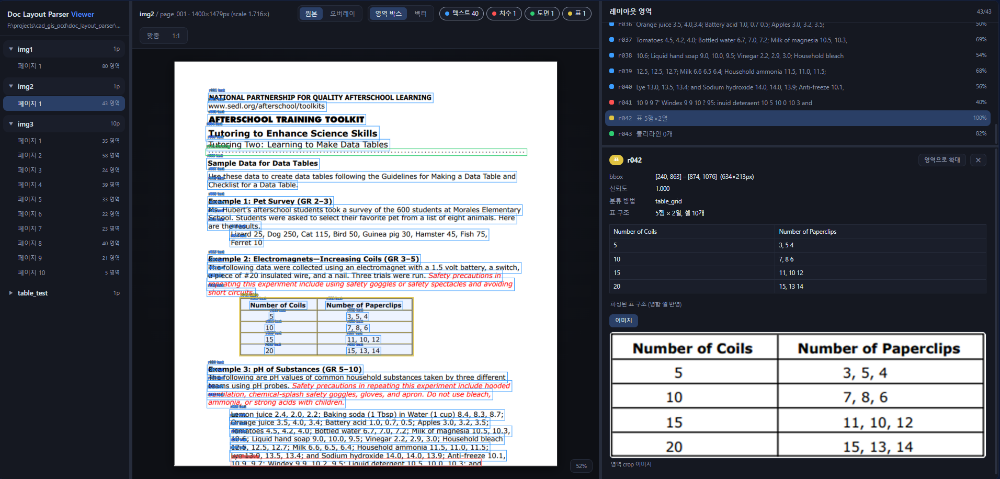
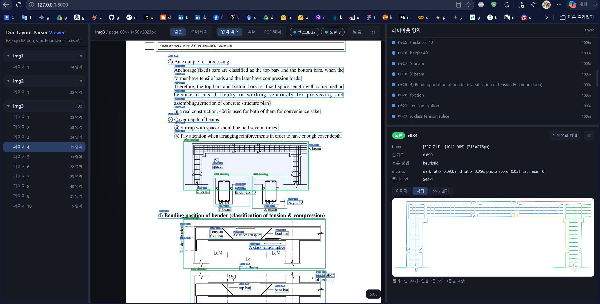
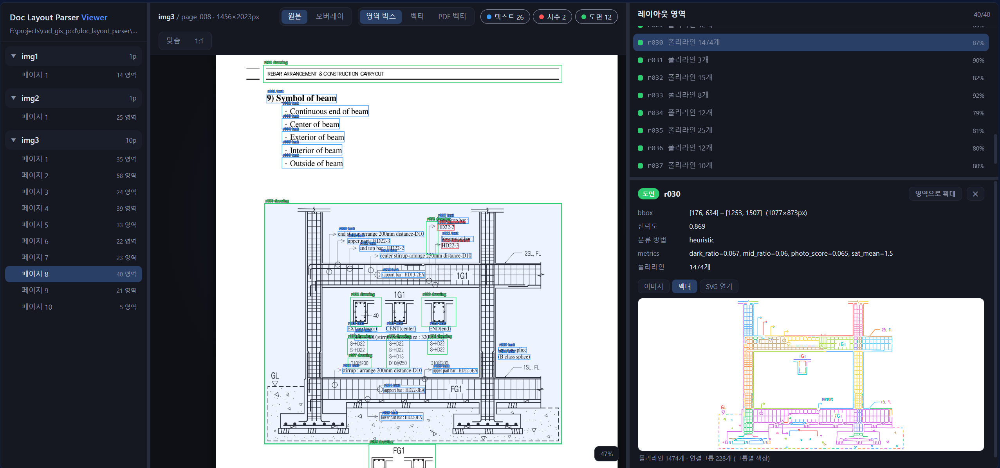
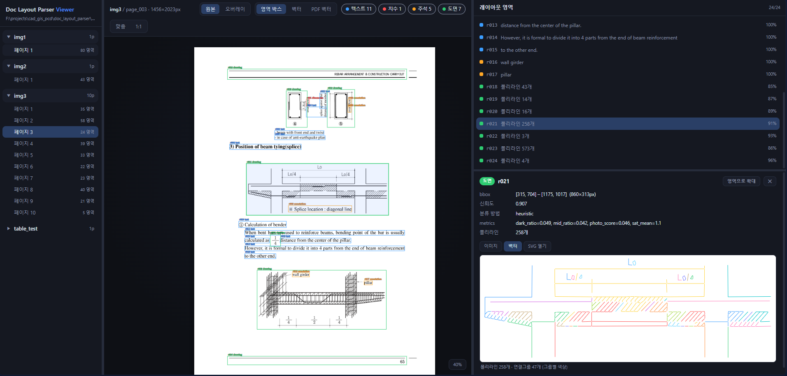

# Doc layout parser

A parser pipeline that reads drawing/document files (jpg, png, pdf), splits them into pages, classifies the layout of each page into **text / dimension /
annotation / image / drawing / table** regions, extracts information per region type (table structure with per-cell text included), and vectorizes drawing regions into polylines. Every extracted item carries its pixel coordinates.

<p align="center">
</img> </br>
</img> </br>
</img> </br>
</img> 
</p>

## Overview

```
input/*.{jpg,png,pdf}
  +- Page split (PyMuPDF: PDF pages are rendered to images; native text
  |               and native vector paths are extracted as well)
  +- Preprocess: automatic upscaling of low-resolution pages
  +- Per-page layout analysis
  |    +- Text detection: EasyOCR (GPU) or PDF native words
  |    |    -> words are merged into lines
  |    |    -> rule-based classification: text / dimension / annotation
  |    +- Page-level table detection: long horizontal/vertical ruling
  |    |    lines are extracted from the raw page; each connected line
  |    |    network becomes a table candidate parsed by the table gates
  |    |    (tables are found whole even when text masking would cut
  |    |     their ink into fragments; detected areas are excluded from
  |    |     graphic region detection below)
  |    +- Graphic region detection: binarization + text masking +
  |    |    morphological dilation + connected components
  |    |    (ink hugging the page edge is erased first so scan/frame
  |    |     borders do not become regions)
  |    |    -> split-table merge fallback: aligned neighbouring regions
  |    |       whose gap is crossed by printed ruling lines are unioned
  |    |       when the union parses as a table
  |    |    -> table check first: ruling-line lattice detection
  |    |       (long horizontal/vertical lines, crossing coverage;
  |    |        drawings are rejected by stray-ink, boundary-span and
  |    |        cell-text-occupancy gates)
  |    |       -> row/col boundaries, merged-cell spans, per-cell text
  |    |    -> non-tables: drawing / image classification: heuristics
  |    |       (saturation, mid-tone ratio, ink ratio), optionally refined
  |    |       by a VLM (Ollama llava / OpenAI / Gemini)
  |    +- Geometric reclassification: content rules are unreliable inside
  |    |    graphics, so text-based regions lying mostly inside a table
  |    |    become plain "text" and inside a drawing become "annotation"
  |    |    (numbers included; the source field gets +in_table/+in_drawing)
  +- Vectorization of drawing regions:
       adaptive binarization -> skeletonize -> pixel-graph tracing
       -> connected segments merged into polylines (closed loops supported)
       -> Douglas-Peucker simplification
       -> polylines sharing endpoints get the same connectivity group id
```

All coordinates in the output are **page pixel coordinates**. When a page is
upscaled, `layout.json` records `scale` and `original_size` so coordinates can
be mapped back to the original image.

## Output structure

Each run deletes and recreates `output/<file_name>/` for the files it
processes, so no stale results from a previous run survive.

```
output/<file_name>/
  result.json                 # file summary (page count, region counts)
  page_001/
    page.png                  # rendered page image
    layout.json               # regions: id, type, bbox [x0,y0,x1,y1], text,
                              # confidence, words, source, ...
    overlay.png               # visualization (blue=text, red=dimension,
                              # orange=annotation, green=drawing, purple=image,
                              # yellow=table incl. cell boxes)
    regions/rNNN_drawing.png  # crops of drawing/image/table regions
    vectors/rNNN.json         # polylines: points [[x,y],...], closed,
                              # length_px, group
    vectors/rNNN.svg          # vectorization result as SVG
    tables/rNNN.json          # table structure: rows, cols, row/col
                              # boundaries, cells [{row, col, row_span,
                              # col_span, bbox, text}]
    native_vectors.json       # native vector paths (vector PDFs only)
```

## Installation

Prerequisites:

- Windows / Linux, Python 3.10+
- NVIDIA GPU recommended (8 GB VRAM is enough); CPU also works
- [Ollama](https://ollama.com) with a vision model — **used by the default
  `config.json`** (`classify.provider: "ollama"`): `ollama pull llava`

```powershell
# Create an environment (conda example)
conda create -n venv_lmm python=3.11
conda activate venv_lmm

# Install dependencies
pip install -r requirements.txt
```

Notes:

- EasyOCR downloads its detection/recognition models (about 120 MB) on first run.
- PyTorch with CUDA is required for GPU OCR; see https://pytorch.org for the
  wheel matching your CUDA version.
- Commercial VLM providers are optional. Set the API key via environment
  variables: `OPENAI_API_KEY` or `GOOGLE_API_KEY`.

## Usage

Before running (with the default `config.json`):

1. **Ollama must be running** with the `llava` model pulled
   (`ollama pull llava`, then make sure the Ollama service/tray app is up).
   The VLM is only called for regions where the heuristic drawing/image
   classification is uncertain (`classify.ambiguous_only: true`). If Ollama is
   not reachable, the pipeline **does not fail** — it logs a warning per call
   and keeps the heuristic result. To skip the VLM entirely, set
   `classify.use_vlm: false` in `config.json`.
2. No other external service is required. ComfyUI is **not** used by this
   project. EasyOCR runs in-process (first run downloads its models, ~120 MB).
3. Only when switching `classify.provider` to `openai` / `gemini`: set the
   `OPENAI_API_KEY` / `GOOGLE_API_KEY` environment variable.

```powershell
# Process every supported file in the input folder (config.json: input_dir)
python main.py

# Process a single file
python main.py -i input\img1.jpg

# Use a different configuration file
python main.py -c my_config.json
```

On this machine the pipeline runs under the conda environment `venv_lmm`:

```powershell
C:\ProgramData\miniconda3\envs\venv_lmm\python.exe main.py
```

## Result viewer (viewer.py)

A Flask-based web app to inspect parsing results interactively — check per
file / page / region whether the parsing is correct.

```powershell
python viewer.py              # serves the output dir from config.json, opens the browser
python viewer.py -o output    # explicit output folder
python viewer.py --port 8000 --no-browser
```

Features:

- **File navigation**: sidebar lists every parsed file under `output/` with its pages
- **Page canvas**: page image with colored region bboxes (same colors as
  `overlay.png`), mouse wheel zoom / drag pan, original ⇄ overlay image toggle
- **Layers**: region boxes, vectorized polylines, native PDF vectors (vector PDFs)
- **Region list & detail**: click a region on the canvas or in the list to see
  its type, confidence, bbox, OCR text, crop image and the vectorized polylines
  rendered as SVG (colored per connectivity group), plus "zoom to region";
  table regions additionally show the parsed cell grid (merged cells preserved)
- **Type filter**: show/hide text / dimension / annotation / drawing / image / table regions

No external service is needed for the viewer (Ollama is not used here).

## Configuration (config.json)

Every tuned threshold and heuristic weight in the pipeline lives in
`config.json` (defaults in `pipeline/config.py`); nothing input-specific is
hardcoded in the modules, so the pipeline can be adapted to other document
styles by editing the configuration only.

| Key | Description |
|---|---|
| `input_dir`, `output_dir` | Input/output folders (relative to the project root) |
| `preprocess.upscale_target_min_side` | Upscale pages whose shorter side is below this value (px). 0 disables upscaling. |
| `preprocess.max_scale` | Maximum upscale factor |
| `pdf.render_dpi` | PDF rendering resolution (default 200) |
| `pdf.use_native_text` | Use embedded PDF text instead of OCR when available |
| `pdf.use_native_vectors` | Extract embedded PDF vector paths |
| `ocr.languages`, `ocr.gpu` | EasyOCR languages and GPU switch |
| `ocr.min_confidence` | Drop OCR results below this confidence |
| `ocr.line_gap_factor`, `ocr.line_row_factor` | Word-to-line merging: max horizontal gap / vertical center distance as a multiple of the character height |
| `ocr.short_line_max_tokens`, `ocr.dim_token_ratio` | Line classification: token count treated as a "short line", and the dimension-token fraction above which a long line counts as a dimension |
| `layout.min_region_area` | Minimum graphic region size (px^2) |
| `layout.dilate_kernel` | Dilation kernel size used to merge nearby ink into regions |
| `layout.page_border_margin_px` | Erase ink within this margin of the page edges (drops scan/frame border artifacts) |
| `layout.text_in_drawing_type`, `layout.text_in_table_type` | Type given to text-based regions inside a drawing (default `annotation`) / inside a table (default `text`) |
| `layout.text_region_overlap_ratio` | Fraction of a text region's area that must lie inside the graphic bbox to trigger the reclassification |
| `classify.use_vlm` | Enable VLM-based drawing/image re-classification |
| `classify.ambiguous_only` | Call the VLM only when the heuristic is uncertain |
| `classify.provider` | `ollama` / `openai` / `gemini` |
| `classify.vlm_max_image_side` | Downscale region crops to this size before sending them to the VLM |
| `classify.heuristic.*` | All thresholds/weights of the drawing/image heuristic (gray-level bounds `dark_gray_max`/`light_gray_min`, normalizers `sat_photo_norm`/`mid_photo_norm`, weights `sat_weight`/`mid_weight`/`dark_ratio_bonus`, decision point `photo_score_threshold`) |
| `table.enable` | Enable ruling-line table detection/parsing |
| `table.min_rows`, `table.min_cols` | Minimum grid size to accept a table |
| `table.min_line_length_ratio` | Ruling lines must be longer than this ratio of the region side |
| `table.min_intersection_ratio` | Required fraction of row×col boundary crossings with ink |
| `table.separator_coverage` | Ruling coverage needed on a cell border; below it cells merge into spans |
| `table.max_stray_ink_ratio` | Max non-ruling, non-text ink inside the grid; above it the region is a drawing, not a table |
| `table.min_line_kernel_px`, `table.stray_dilate_px` | Lower bound of the ruling-line morphology kernel / line-mask dilation used by the stray-ink check |
| `table.merge_max_gap_px`, `table.merge_axis_overlap` | Split-table merge: max gap between aligned neighbouring regions / required bbox alignment along the other axis |
| `table.merge_bridge_coverage` | Fraction of the gap a printed ruling line must cross for two regions to count as one split table |
| `table.page_level_detection`, `table.network_gap_px` | Detect tables from the page's connected ruling-line networks / bridge line breaks up to this size when connecting them |
| `table.min_boundary_span_ratio` | Every ruling line must cover this fraction of the grid extent (crossing lines in drawings leave short boundaries) |
| `table.min_cell_text_ratio` | Fraction of cells that must contain text; mostly-empty lattices (drawing line networks) are rejected. Lower it for form-style tables with many blank cells |
| `vectorize.simplify_epsilon` | Polyline simplification strength (px) |
| `vectorize.min_polyline_length_px` | Drop polylines shorter than this (noise filter) |

## Technology choices

- **PyMuPDF**: the most reliable library that covers PDF page rendering plus
  native text and vector path extraction. For vector PDFs the original paths
  are exported directly, which is far more precise than raster vectorization.
- **EasyOCR**: Korean + English out of the box, GPU accelerated, light enough
  for 8 GB VRAM.
- **Hybrid layout analysis**: generic document layout models (LayoutParser,
  DocLayout-YOLO, ...) are not trained on CAD sheets and misclassify
  dimensions/annotations/figures. Content rules on OCR results combined with
  classic CV region detection and an optional VLM check is more dependable.
- **skeletonize + graph tracing** (scikit-image / OpenCV): the standard
  approach for centerline vectorization of line drawings. Outline tracers such
  as potrace produce contours, not centerlines, so they do not fit this task.
- **Ollama (llava)**: local VLM that fits in 8 GB VRAM for drawing/image
  disambiguation. If its quality is not sufficient, switch
  `classify.provider` to `openai` or `gemini`.

## Known limitations

- Very low resolution inputs (text height under ~5 px) cannot be recovered by
  OCR even after upscaling; use source scans of 3000 px or larger for reliable
  text extraction.
- The local llava model is a weak classifier; keep the heuristic as the primary
  signal or switch to a commercial VLM for higher accuracy.

# Author 
laputa99999@gmail.com